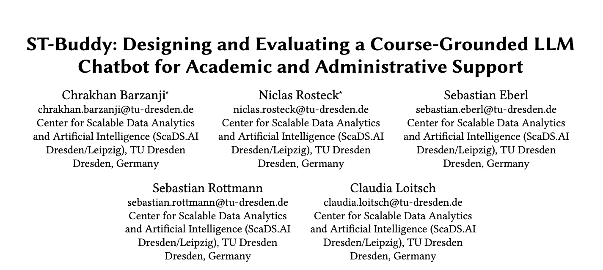

# [](https://metis.scads.ai)

[**Metis**](https://metis.scads.ai) is a chatbot with the goal of providing students support in many aspects of their studies.
It is designed to be modular and support many different types of bots with different underlying architectures.
Metis aims to assist the user based on their learning type (sensing, feeling, intuitive, thinking).

**Check Metis out [here](https://metis.scads.ai)**

This project is maintained by the research group [KI_FEM](https://tu-dresden.de/ing/informatik/ai/mci/forschung/nachwuchsforschungsgruppe-bedarfsorientiertes-ai-coaching-fuer-studierende-naic/ki-basiertes-coaching-studierender) at ScaDS.AI.

## ST-Buddy Study

This is the version of metis used in the ST-Buddy evaluation based on v1.0.4 of metis. This is the codebase used in the study published in CHI26 with the title "*ST-Buddy: Designing and Evaluating a Course-Grounded LLM Chatbot for Academic and Administrative Support*".



### How to cite
```tex
@article{
    CITATION FOLLOWING AFTER RELEASE
}
```

## Installation
ne the repository

- Install [Python 3.12.5](https://www.python.org/downloads/) (and for UNIX also the following packages)

  ```sh
  sudo apt install python3 python3-venv python3-tk
  ```

- Create a virtual environment for Python

  ```sh
  python3 -m venv .venv
  ```

  - For UNIX: Activate via

    ```sh
    source .venv/bin/activate 
    ```

  - For Windows: Activate via

    ```sh
    .venv/Scripts/activate.ps1
    ```

- Install the dependencies from requirements.txt:

  ```sh
  cd backend
  pip install -r requirements.txt
  ```

### Create embeddings for the markdown documents in /data

- go to /backend/src and run:

```sh
python3 ingest.py
```

### Create the .env environment file

- Go to /backend and /frontend, duplicate the `.env.example` file and rename it to `.env`
- Fill in the values as described in the file

## Start the services

### Backend

1. **Go to the src directory**

   ```sh
   cd backend/src
   ```

2. **Run FastAPI using uv**

    ```sh
    fastapi dev
    # or
    python3 -m uvicorn api:app
    ```

    This will start the backend on <http://localhost:8000> and reload automatically when changes in the files are detected.

### Frontend

Make sure you have the following installed on your machine:

- [Node.js 22](https://nodejs.org/)
- [npm 10.8.3](https://www.npmjs.com/)

1. **Open a new tab in your console and go to the frontend directory:**

   ```sh
   cd frontend
   ```

2. **Install dependencies:**

   ```sh
   npm i
   ```

3. **Start the development server**

   ```sh
   npm run dev
   ```

    This will start the frontend on localhost: <http://localhost:5173/>

## LLMs

### Keys

Keys for the LLMs are set in the backend/.env file.

### Local LLMs

When using the locally cached HuggingFace models, the model is dowloaded when you run the chatbot for the first time. It is stored in your cache folder (tyically `~/.cache`) on your local machine.

**Please note**: An internet connection is required to run the application and download the model.

IMPORTANT: For the open-source release of metis, all data from the data folders has been removed. If you wish to host your own version of ST-Buddy, add your data to the data folder manually and ingest into the vector_db.

## Tests

### Backend tests

Backend tests are performed by `pytest`. To run the tests, navigate into `/backend` and run

```sh
pytest [-v] [-vv]
```

To merge a PR, you also have to check that code quality checks succeed using:

```sh
ruff check src/
```

(if ruff is not installed yet, run `uv sync` and then `uv run ruff check src/`)

#### Creating new tests

New tests can be added by creating a new file in the `/backend/tests` folder named `test_[name]`. Follow the scheme of the other test files. It's best to sort the tests by the folder structure of the class you are trying to test.

### Frontend tests

TODO